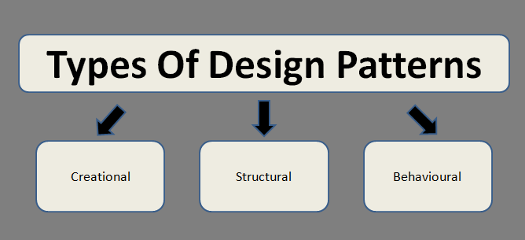
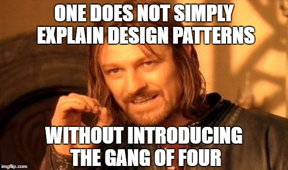

When a software developer stumbles upon a problem which is continuously the same in writing or coding activities during developing software or application in a project then, a design pattern is required for solving the problems which are similar to the concept or template to be applied and used in the programming languages. It is only effective when the developer ever encounters the previous problem by trial and error in developing the software or applications. 

In The Gang of Four, there are 23 design patterns which are divided into 3 groups, namely:

1. Creational Pattern is a pattern used to solve problems encountered in the event of making an instance or object. 
2. Behavioral Pattern is a pattern used to solve problems encountered in communication between objects or classes.
3. Structural Pattern is a structure or relations between classes and objects which interact and distribute responsibilities.

Click this [link](https://www.oodesign.com/) to get more detailed in these three groups.

The most common design patterns are Factory, Singleton, Observer, and Model-View-Controller (MVC).  In the Factory design, it creates objects without using the original logic and makes different classes of returned objects to create the dependent object. In Singleton, it provides a single instance of the global variable in an object-oriented language which it does not support and it will create a complex global state. Many consider it as an anti-pattern which gives the solution to negative outcomes. In Observer, a set of object called observer occurs a change or reaction to the other state of object called as the subject. The reactive variable in code referencing will be re-run when the variable changes to update to the current situation. In MVC, the implementing of the user interface is separated from the model in the user’s state. 

In our daily life, we will encounter countless design patterns with special patterns for every product such as I-phone with its Apple logo, “Michael Jordan” as NBA basketball player and so on. When I was in junior high, I wanted to be a badminton player. I watched (View) many good players (Model) playing this badminton during badminton competitions. I tried hard to learn (Controller) the ways how to attack and defend by following their styles in confronting their opponents. It is designed that correct positions will make a better-returned serve to the opponents and the patterns are always similar whenever they defending the attack. In this way, I discovered that there are relations and interactions between my body position and hand power in the process of playing badminton. I will make less error if I am following the MVC design patterns. 

In conclusion, a design pattern is a solution for reducing repetitive errors in software engineering and object-oriented programming, as it makes the code to be more efficient and effective in its implementations. Also, in a variety of different situations, it shows the relations and interactions between classes and objects but without explaining the class and final object involvement in the application.
