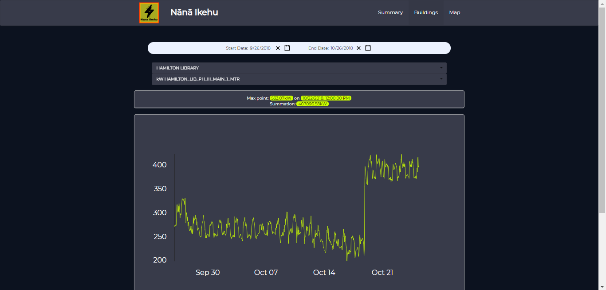

Nana Ikehu is an open source project that analyzes the efficiency of the energy usage of each building in the University of Hawaii at Manoa (UHM) by using the Meteor application. It is symbolized by maps and graphics diagrams for the utilization of energy on each building. This project is using the applications of Meteor Js, React Js, Semantic-UI and Victory for running the program. 

The users will be able to watch the amount of energy usage for each building on the UHM map or by selecting individual building through the drop-down menu. This application will be used as a control for each individual department to maximize efficiency for the energy usage. Then, it will cut the expenditures for unnecessary usage and increase or maximize profits for UHM. If the users are not familiar with the Meteor app, they can deploy it to Galaxy. 

This project consists of four people with individually contributing their thoughts and ideas to be applied to this application. Each member contributes ideas and the best will be chosen for the project by comparing the pros and cons of individual ideas. Some of my contributions as a team are improving the user interface by using HTML, CSS (customizing the landing pages, summary, buildings list) to be user-friendly way, fixing small issues by adding some functions that make the data executable, applying fixes ESLint for component and layout files for the project.  This is considered as the front-end job for the team. 

In this project, it elevates my ability in implementing the Meteor application to be executed in the program. Although there is a time constraint in this project, my team has managed to finish it in a timely manner due to good teamwork among us. Also, it improves my software engineering practices in developing the Meteor application being implemented to the project. 

Here is the [link](http://nanaikehu1.meteorapp.com/#/) for the deployment.

Here is the source code for this project: [github@nanaikehu](https://github.com/nanaikehu/Nana-Ikehu)
