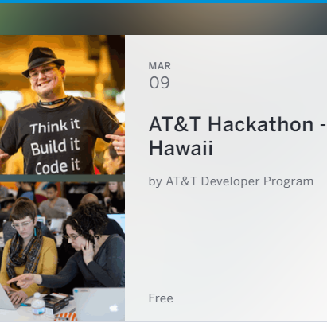
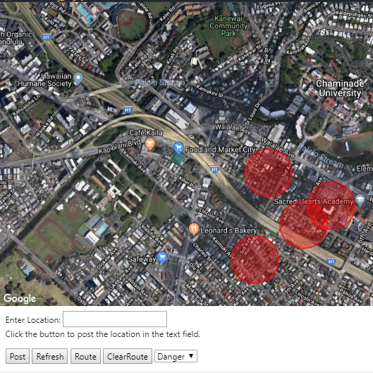

Before the activity started, I had to introduce briefly about the Hackathon. It was a 48 hours (2 days) competition designed for people (in a group of 4 or 5person) to build anything related to the mobile apps, game design, web development, etc. This competition required competitors to bring their laptops, skills, and ideas. I joined this Hackathon which was represented by the AT&T Developer Program in Hawaii.

In order to start our project as a group, we had kept spreading our own ideas and choose one of the best ideas to be used in our project. I worked with other students to design and modified a website that connected to the Google map. We used HTML and CSS code to work on our project. Basically, our ideas were making a sign signals in every place that could be considered as the crime-prone points, like theft, drugs, severe persecution, or even more specific like an accident that just happened in that region. We marked the location by representing the red small circle using our HTML. All of these activities were done together without being specifically defined who would be the leader of the group.

As this is my first real-life experiences in-participating this kind of activity. I am really flattered and satisfied with this Hackathon activity. It is not just about meeting new friends but also sharpen our abilities to be more creative and imaginative. I think this is one of the best opportunities for me to develop the skills that I needed in my future projects.

The source code for this project is on [github@bigdimsum](https://github.com/bigdimsum/dimsum/tree/master/src/template)

Here is the link on how we create the circles point[  [circle-simple](https://developers.google.com/maps/documentation/javascript/examples/circle-simple).
