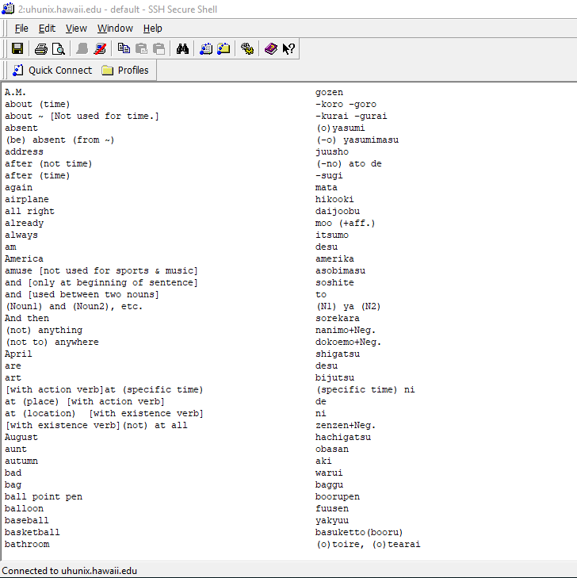

This assignment is obtained in my ICS 212 class which is basically focusing more on C/C++ programming language. The instruction is to write a program in which can sorts the text files by a given file from my instructor. In the file, the English and Japanese with the same word are separated by a tab(‘\t’). However, the English part is not being sorted yet. Therefore, the goal of this assignment is to understand by writing a program using the proper function in order to sort all of the English words from those text files. 

I think the challenging part is when I had to break the line into three parts which originally were the English part, the Japanese part, and the sort field. I had to figure out how to split the English and Japanese parts by finding the character position of the tab. I had to take a substring for the first part (English part) and also for the second part (Japanese part) of each line. Then, for the sort field, I had to change all the uppercase to lowercase letters and remove any characters enclosed in brackets & parenthesis in front of any words.

The rest was just filler, for example, I had to add the ifstream class so that it could read one line at a time from the input file. In addition, I defined a class for Entry which had three strings as data members. It was generally writing the default constructor, set functions and get function for those three data members.

Overall, I have learned a lot about how sorting text files works from this assignment. It makes me really understand all the needed functions to break the line into parts, like English part, Japanese part, and sort field. Also, I feel that understanding the substring is crucial.

Here is my brief example of codes on how I break the line into 3 parts with using substring for each part and display the sorted for the English and Japanese parts in my sorted Entry objects.
```js
125     while(!fileInputStream.eof()){
126         //Break the line into three parts as described on the assignment webpage. 
127         //Store the data for each line in an Entry object. 
128         getline(fileInputStream, line);
129         int i = line.find('\t');
130         if(i > 0){
131         //cout<<line<<endl;
132         entry.setEnglish(line.substr(0, i));
133         entry.setJapanese(line.substr(i));
134         entry.setSortfield(entry.getEnglish());
135         //Store each Entry object in the vector
136         e.push_back(entry);
137         }
138         //fileOutputStream<<line<<endl;
139         //cout<<lineEnglish<<"\t"<<endl;
140     }
141 
142     //Sort the vector of Entry objects.
143     sort(e.begin(), e.end());
144     cout<<setiosflags(ios::left);
145     for(int i = 0; i<e.size(); i++){
146         cout<<setw(50)<<e[i].getEnglish()<<e[i].getJapanese()<<endl;
147     }

```
