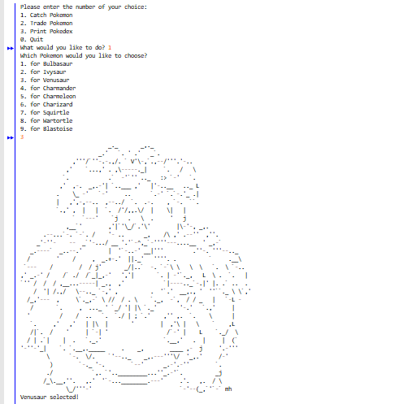
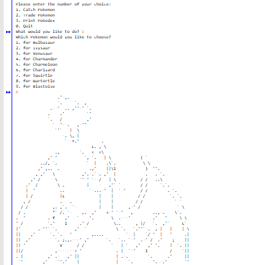
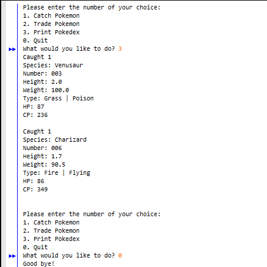

Have you ever heard of Pokémon Go? Yes, it is an AR mobile game that has become popular since it was released in 2016. In my ICS 211, I had to write a program in java that will simulate the process of how this game actually works. 

In the driver program, it is basically asking the user to catch Pokémon (add Pokémon object), trade Pokémon (remove Pokémon object), or print Pokémon (results). Also, it will terminate/ends the program once the user chooses to quit the game.  The goal of this project is to understand on how to modify the Binary Search Tree (BST) and at the same time, makes other classes which posses different implementations and function for each class (like create nodes, implement all the binary search tree functionality). 

Based on the experience that I had for this project, I have learned a lot from this assignment.  It taught me how actually the binary search trees works, binary tree traversals, recursive method, and a method that will add/remove Pokémon’s objects. Also, it had improved my skills in analyzing and communicating with other students by using GitHub as it was the requirement of this course to be applied in the project.

Here is the source code for this project:
